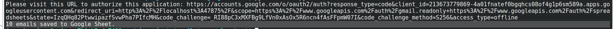
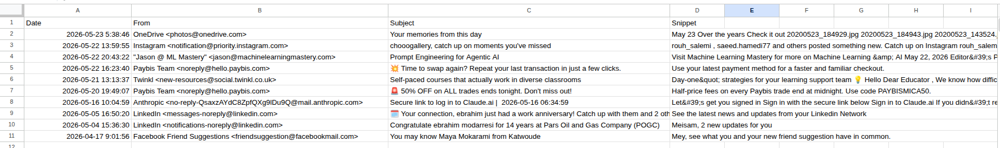

# Email Automation with Gmail API and Google Sheets

A Python automation project that reads recent Gmail emails using the Gmail API and saves them into a Google Sheet automatically.

---

## Features

- Read recent Gmail emails
- Extract sender, subject, date, and snippet
- Save email data to Google Sheets
- OAuth2 authentication
- Environment variable support
- Error handling
- Google API integration

---

## Technologies Used

- Python
- Gmail API
- Google Sheets API
- Google Cloud OAuth2
- python-dotenv
- Git
- GitHub

---

## Project Structure

```text
email-to-google-sheet/
├── screenshots/
│   ├── program-run.png
│   └── google-sheet-output.png
├── main.py
├── credentials.json
├── token.json
├── requirements.txt
├── README.md
├── .env
└── .gitignore
```

---

## Installation

Clone the repository:

```bash
git clone https://github.com/najafi81/email-to-google-sheet.git
```

Go to project directory:

```bash
cd email-to-google-sheet
```

Create virtual environment:

```bash
python3 -m venv venv
```

Activate virtual environment:

### Linux / macOS

```bash
source venv/bin/activate
```

Install dependencies:

```bash
pip install -r requirements.txt
```

---

## Google Cloud Setup

Enable these APIs in Google Cloud Console:

- Gmail API
- Google Sheets API

Create OAuth credentials:

```text
OAuth Client ID → Desktop App
```

Download:

```text
credentials.json
```

and place it inside the project directory.

---

## Environment Variables

Create a `.env` file:

```env
SPREADSHEET_ID=your_google_sheet_id
SHEET_NAME=Sheet1
MAX_EMAILS=10
```

---

## Usage

Run the program:

```bash
python main.py
```

The program will:

1. Authenticate with Google OAuth2
2. Read recent Gmail emails
3. Extract email information
4. Save email data into Google Sheets

---

## Google Sheet Columns

| Date | From | Subject | Snippet |
|---|---|---|---|

---

## Screenshots

### Program Execution



### Google Sheet Output



---

## Security Notes

These files should NOT be uploaded to GitHub:

```text
credentials.json
token.json
.env
```

---

## Future Improvements

- Save attachments
- Filter emails by sender
- Use Gmail search queries
- Schedule automatic execution
- Add CSV export
- Add logging to file

---

## Author

Meisam

GitHub:
https://github.com/najafi81
